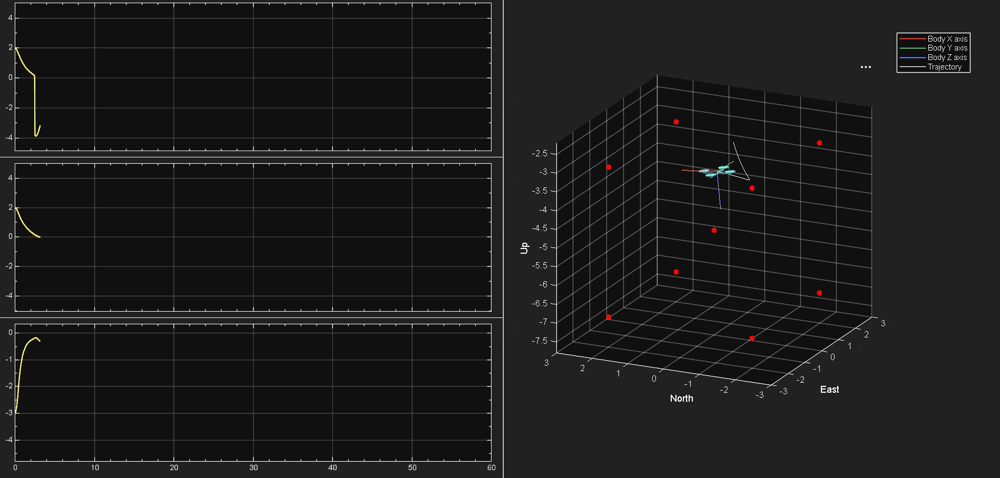
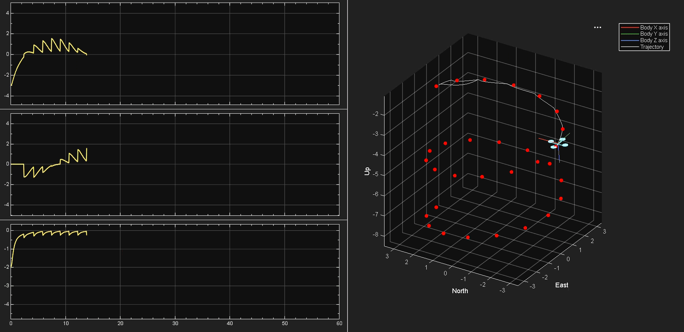
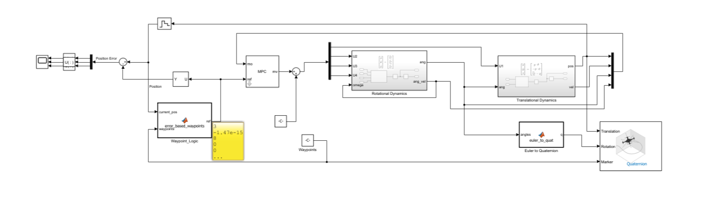

# Quadcopter-MPC-Simulink

Quadcopter Waypoint Navigation via Model Predictive Control (MPC).

*3D Cubical Edge-Tracking Positional Error and simulation*

*Helical ClimbPositional Error and simulation*

## Overview
This repository contains a high-fidelity 6 Degrees of Freedom (6-DOF) quadcopter simulation built in MATLAB and Simulink. The core of the project is a tightly tuned Model Predictive Controller (MPC) designed to navigate a linearized drone plant through complex 3D environments. 

The system maps standard X, Y, Z coordinates into a full 12-state reference vector, calculating optimal thrust and torques to manage inertia, eliminate overshoot, and execute precise maneuvers.

## Features
* **Custom MPC Architecture:** A fully tuned controller with optimized Prediction Horizons and Cost Function Weights (Q and R) to dampen velocity and prevent aggressive overshoot.
* **Complex Flight Profiles:** Includes MATLAB scripts to generate raw waypoint matrices for advanced trajectories:
  * *3D Cubical Edge-Tracking [Simulation video](./media/waypoint_navigation1.mp4).*
  * *Helical Climb [Simulation video](./media/waypoint_navigation2.mp4).*
  * *Lissajous Figure-Tracking [Simulation video](./media/waypoint_navigation3.mp4).*
* **Real-Time 3D Visualization:** Integrates with Simulink's UAV Animation tools to visualize the flight path and attitude adjustments in real-time.
* **Modular Plant Dynamics:** Physics are decoupled into independent Translational and Rotational subsystems utilizing small-angle approximations.

## System Architecture

*Simulink model MPC Quadcopter Controller.*

The Simulink model is driven by four primary custom MATLAB Function blocks:
1. `Waypoint_Logic_Engine`: Calculates 3D Euclidean error and triggers the next target upon entering a 0.3m arrival threshold.
2. `State_Reference_Formatter`: Pads the 3D position target into a 12x1 state vector, commanding zero angular and linear velocities for stable hovering.
3. `Linear_Quadcopter_Physics`: Calculates state derivatives (Accelerations) based on thrust inputs and drone mass/inertia.
4. `Euler_To_Quat_Converter`: Maps 3D aerospace Euler angles (Roll, Pitch, Yaw) into 4D Quaternion space for the 3D visualizer.

## How to Run
1. Clone the repository and open the project folder in MATLAB.
2. Open the main Simulink model [View Model](./models/quadcopter_model.slx).
3. **Import and Select Flight Path:** Import the Flight Path from [Flight Paths](./data) and set your desired flight profile matrix(Cube, Helix, etc.) in waypoints block.
4. **Enable Video Pacing:** In the Simulink toolstrip, click the dropdown under **Run** -> **Simulation Pacing** and set the rate to `1`. This ensures the simulation runs in real-time for visual tracking.
5. Hit **Run**. 
6. Observe the 3D Animation window and the real-time Error Scopes to evaluate the MPC's performance.

## Control Theory Notes
The plant is linearized around a stable hover state. Because the system relies on small-angle approximations (where `cos(theta) ≈ 1`), aggressive maneuvers beyond 30-degree tilt angles may exhibit slight altitude drop due to unmodeled non-linear loss of vertical lift. The MPC is heavily weighted on velocity tracking (`Q-matrix`) to artificially damp the system and maintain linear stability during sharp cornering.
